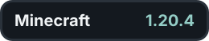
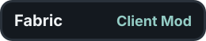
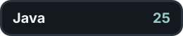
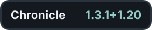

<p align="center">
  
</p>

<p align="center">
  <a href="README.md"></a>&nbsp;&nbsp;
  <a href="README.ru.md"></a>&nbsp;&nbsp;
  <a href="README.zh-CN.md"></a>&nbsp;&nbsp;
  <a href="README.es.md"></a>&nbsp;&nbsp;
  <a href="README.de.md"></a>
</p>

<p align="center">
  <a href="https://github.com/aspectra00/Chronicle"></a>&nbsp;&nbsp;
  <a href="https://ko-fi.com/aspectra"></a>&nbsp;&nbsp;
  <a href="https://modrinth.com/mod/chronicle-reminders"></a>&nbsp;&nbsp;
  <a href="https://www.curseforge.com/minecraft/mc-mods/chronicle-reminders"></a>
</p>

<p align="center">
  
  
  
  
</p>

Chronicle es un mod de recordatorios para el cliente de Minecraft. Funciona tanto en partidas individuales como en servidores multijugador sin instalar nada en el servidor.

## Apoya Chronicle

Chronicle es gratuito y se mantiene para todas las versiones compatibles de Minecraft. Si te ha ahorrado tiempo o te ha ayudado a no olvidar algo importante, puedes apoyar el desarrollo, las pruebas y las futuras actualizaciones.

<p align="center">
  <a href="https://ko-fi.com/aspectra"></a>
</p>

El apoyo se destina a la compatibilidad, las pruebas de versiones y nuevas funciones de recordatorios. Los miembros también pueden elegir aparecer en la pantalla Community Supporters dentro del juego.

## Funciones

### Recordatorios

- Programaciones diarias
- Programaciones semanales con días seleccionables
- Intervalos de repetición personalizados
- Activar, editar, desactivar o eliminar recordatorios dentro del juego
- Conservar, desactivar o eliminar un recordatorio después de activarse
- Probar la configuración actual de las notificaciones desde el menú

### Reglas de activación

Un recordatorio puede activarse cuando:

- La salud, el hambre o el aire alcanzan un nivel definido
- El inventario está lleno
- El objeto en la mano alcanza un límite de durabilidad
- El jugador entra en una dimensión
- El jugador entra en una zona X/Z configurada

Las reglas se activan cuando su condición pasa de falsa a verdadera. Vuelven a quedar listas cuando la condición deja de cumplirse.

### Watch This

Mira un objetivo compatible y pulsa `R` para empezar o dejar de observarlo. Chronicle puede avisarte cuando:

- Un cultivo termina de crecer
- Una colmena o un nido de abejas se llena de miel
- Un caldero o compostador está listo
- Las enredaderas de cueva producen bayas luminosas
- Un horno, ahumador o alto horno se detiene
- El cobre se oxida por completo
- Una cría crece

La pantalla Watches muestra los objetivos activos del mundo o servidor actual. Chronicle solo comprueba datos que ya están disponibles para el cliente, por lo que los objetivos de zonas no cargadas permanecen pendientes.

### Notificaciones

- Diseños Modern y Vanilla
- Botones opcionales Snooze y Dismiss en el diseño Modern
- Posponer durante 5, 10, 15, 30 o 60 minutos
- Historial de recordatorios perdidos, completados y pospuestos
- Temas Minimal, Neon, Glass y Matrix
- Título, icono, colores, tamaños y animación configurables
- Fondo PNG o JPG opcional para las notificaciones Modern
- Vista previa en tiempo real
- Sonido de notificación original, silenciado o personalizado

El audio personalizado admite MP3, OGG, WAV, AIFF y AU. JLayer se incluye para decodificar MP3; consulta los [avisos de terceros](THIRD_PARTY_NOTICES.md).

### Marcadores

El texto de los recordatorios admite:

- `{world}`
- `{coords}`
- `{biome}`
- `{dimension}`

También se admiten los marcadores registrados mediante Text Placeholder API.

### Idiomas

- Inglés
- Ruso
- Chino simplificado
- Español
- Alemán

## Controles

| Tecla | Acción |
|---|---|
| `J` | Abrir Chronicle |
| `R` | Observar o dejar de observar el objetivo bajo la mira |

Ambas teclas se pueden cambiar en los ajustes de controles de Minecraft.

## Requisitos

| Dependencia | Versión |
|---|---:|
| Minecraft | 1.21.10 |
| Fabric Loader | 0.17.0 o posterior (se recomienda 0.19.3) |
| Fabric API | 0.138.4+1.21.10 |
| Java | 21 |

Mod Menu es opcional. Text Placeholder API está incluido en el JAR de Chronicle.

## Instalación

1. Instala Fabric Loader y Fabric API para la versión indicada de Minecraft.
2. Copia el JAR de Chronicle en la carpeta `mods`.
3. Inicia Minecraft y pulsa `J`.

Los ajustes se guardan en `config/chronicle.json`.

## Compilación

Usa la versión de Java indicada arriba y ejecuta:

```powershell
.\gradlew.bat clean build
```

El JAR generado se guarda en `build/libs`.

## Licencia

Chronicle está disponible bajo la [licencia MIT](LICENSE).
